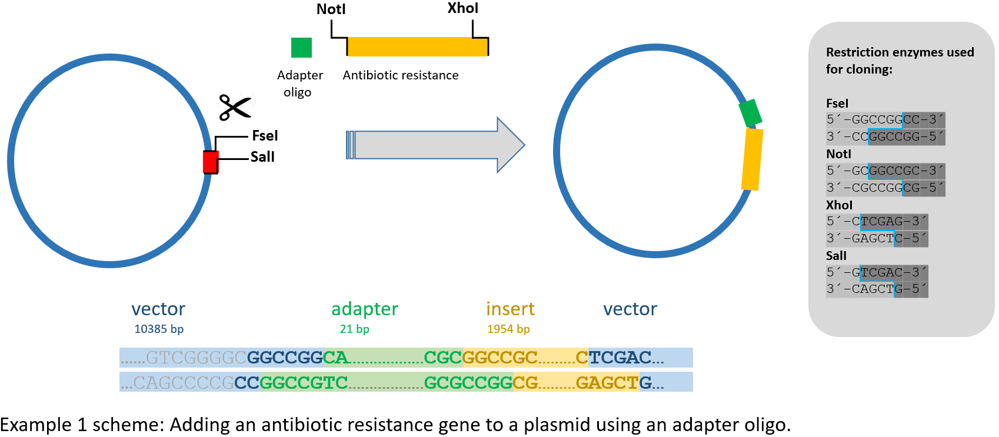
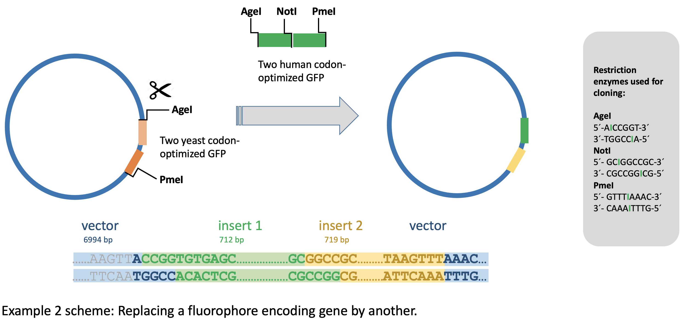
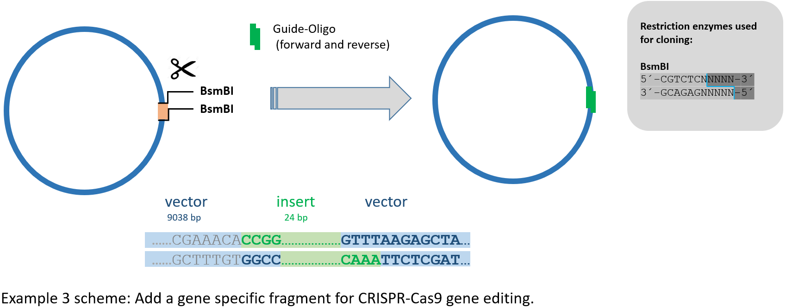

Examples
========

Example 1 - Cloning of a three-fragment plasmid.
^^^^^^^^^^^^^^^^^^^^^^^^^^^^^^^^^^^^^^^^^^^^^^^^
This is the example that can be loaded on preselector.uni-jena.de. Here, we cloned a ~2kb insert into a ~10kb recipient plasmid to create a ~12kb final plasmid. We cut out the insert from the donor plasmid with the restriction enzymes NotI and XhoI and opened the backbone with FseI and SalI. Since the overhangs created by NotI and FseI are not compatible, we designed a small adapter fragment with NotI and FseI compatible overhangs. However, now we had three fragments to ligate - insert, adapter, and backbone. This reduces the probability of a complete ligation and leads to background contamination with religated recipient plasmids. Consequently, none of the colonies we analyzed did contain the desired final plasmid but only religated donor recipient plasmids. To not waste more time on screening colonies, we instead decided to use a preselection digest. In this particular case, we had designed the adapter such that the FseI recognition site was deleted upon ligation, so that we could safely use FseI for this step. As a result, the number of colonies was considerably reduced, but we were able to directly isolate the desired construct from seven out of ten colonies. While designing, we still had to avoid choosing an enzyme that cuts the insert and validate the final plasmid. We did this with preselector.uni-jena.de. It returned four suitable enzymes including the one we used. In other cases of ligating three fragments, it may not be feasible or desirable to delete a restriction enzyme site as described here, making it necessary to find a fitting enzyme first (as described in Example 2).

Example 2 - Replacing a fluorophore encoding gene by another.
^^^^^^^^^^^^^^^^^^^^^^^^^^^^^^^^^^^^^^^^^^^^^^^^^^^^^^^^^^^^^
Here, we replaced the fluorophore in the plasmid pET296-YcpLac111-EF1a-MCP-NLS-2xyeGFP. The plasmid encodes a mRNA-binding MS2-coat protein (MCP), and its sequence is fused to two open reading frames (ORFs) encoding a EGFP for fluorophore-tagging. However, these original ORFs were codon optimized for expression in yeast, whereas we intended to express the construct in human cells. Therefore, we cut out both original EGFP sequences with the restriction enzymes PmeI and AgeI and amplified two human codon optimized EGFP sequences from another plasmid with PCR. We digested the PCR products with the appropriate enzymes and tried to ligate them into the MCP recipient plasmid. However, despite several attempts, we could not get a clone with both human codon optimized EGFP fragments integrated. We therefore decided to use a preselection digest that would cut the original recipient, but not the final plasmid. preselector.uni-jena.de returned twelve enzymes, and we chose MscI. This preselection digest gave less colonies after transformation, but they contained the desired clone.

Here, we cannot rely on the multiple cloning site, since the restriction enzyme sites there may also exist in the MCP and EGFP sequence portions, so that we have to check the whole construct.

Example 3 - Add a gene specific fragment for CRISPR-Cas9 gene editing.
^^^^^^^^^^^^^^^^^^^^^^^^^^^^^^^^^^^^^^^^^^^^^^^^^^^^^^^^^^^^^^^^^^^^^^
A cloning step is also typically required for CRISPR-Cas9 dependent gene editing. The Cas9 enzyme uses a specific guide RNA to recognize a target sequence. Here, we used a backbone containing a fluorescent-tagged Cas9 with a guide RNA, which we completed by inserting a custom oligonucleotide for sequence specificity.
To do that, we opened the backbone at both sites with the restriction enzyme BsmBI. To avoid the laborious and time-consuming task to identify the right colony after transformation, we used a preselection digest. For that, we used BsmBI, which we found with preselector.uni-jena.de among other three restriction enzymes we could use.
It is not hard to imagine a slightly different scenario, in which, depending on the insert, no enzyme exists that cuts the recipient but not the final vector. This would make us double and triple check our search if done manually. However, with preselector.uni-jena.de we can be sure that we either must change our CRISPR target site or that we must use another CRISPR-Cas9 recipient plasmid with a different multiple cloning site.

