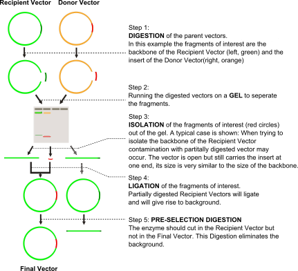

preselector.uni-jena.de
=======================

preselector.uni-jena.de (https://preselector.uni-jena.de/) is a free online tool for planing preselection digests in molecular cloning. Digests of donor vectors with restriction enzymes can be incomplete. This contamination leads to religation of the donor backbone, and results in a high background level of false positive clones. Preselection digests can reduce or even eliminate this background (illustrated below).

preselector.uni-jena.de identifies fitting restriction enzymes for preselection digests by finding the enzymes that cut in one sequence (e.g. the recipient plasmid) but not in the other (e.g. the final plasmid). The tool is implemented in JavaScript and runs locally in the browser of the user, guaranteeing confidentiality of DNA sequences.

**Table of Contents:**

.. toctree::
   :maxdepth: 2

   quickguide
   examples
   about
   
preselector.uni-jena.de has been developed in the Mrowka Lab.
