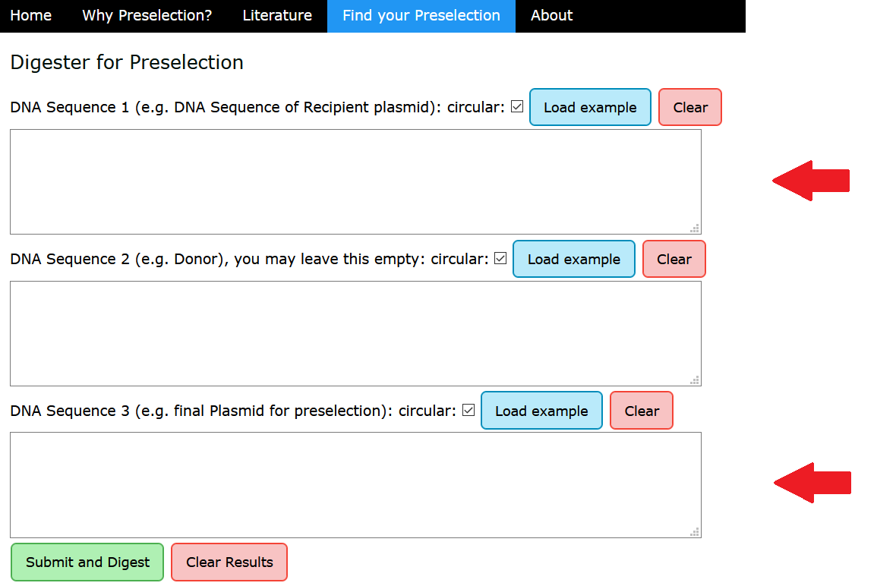
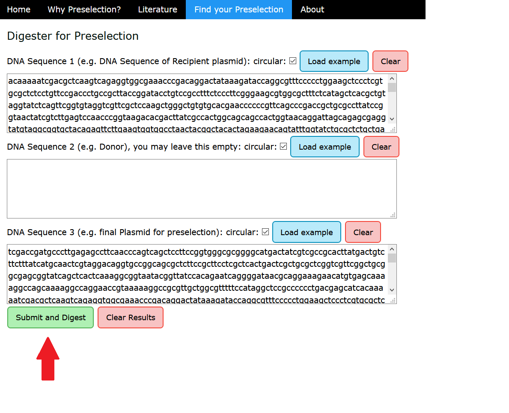
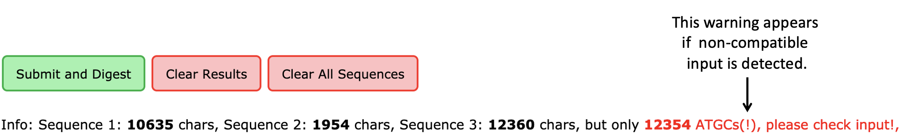

Quick Guide
===========

1. Paste your DNA sequences into the respective fields, and check the box if your sequence is circular. Sequence 1 should be the sequence of the recipient backbone, and sequence 3 the final plasmid including the insert. Sequence 2 is optional, and can be used for the donor plasmid. (Although this tool is designed for preselection digests, you can of course also use it to compare restriction enzyme site availability for any other application.)

2. Choose the restriction enzymes you wish to include in the search. You can do this by selecting enzymes from the list using the errors. Alternatively, you can provide a text file containing the enzymes (format in right panel). The file should contain one enzyme per row, and unknown enzymes will be ignored. In addition, you can save the list of used enzymes for your documentation or later reuse.

  
3. Click "Submit and Digest" to run the analysis.

4. Your results will be displayed in the table below. The results are separated by cutting enzymes (b) and non-cutting enzymes (c) for every sequence provided. In (a), the enzymes that cut in sequence 1 (recipient backbone, left column), or sequence 2 (donor, right column), respectively, but not in sequence 3 (final plasmid).

