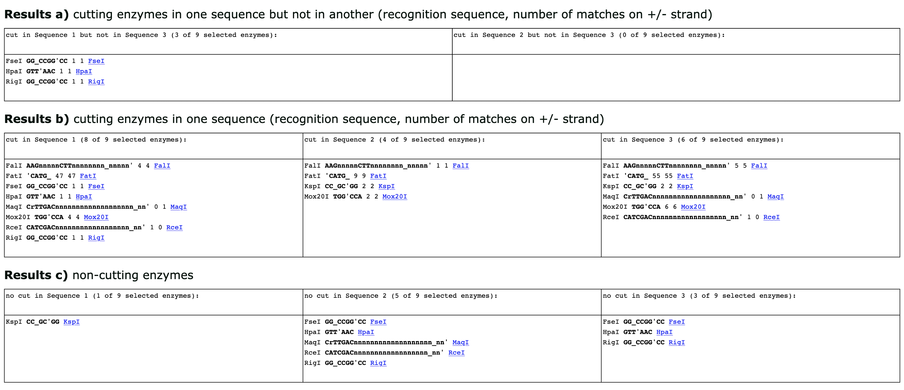

Quick Guide
===========

1. Paste or load from file your DNA sequences into the respective fields, and check the box if your sequence is circular. Sequence 1 may be for instance the sequence of the recipient plasmid, and sequence 3 that of the final plasmid including the insert. Sequence 2 is optional, and can be used that of the donor plasmid. The sequences can be raw or in fasta format and also be quite long since they are not uploaded to the server, but processed in the local browser. If more then one fasta sequence is in one text field then the first one is used and the others are ignored. The sequences should only contain the four canonical bases A, C, G, and T, case is ignored. Characters that are not letters in the English alphabet are ignored. Sequences for instance may come with a base pair index on the start of every new line. If a sequence contains another letter then A, C, G, or T, a warning is displayed below the "Submit and digest" button on submission. We recommend fixing this problem, since Preselector cannot know what do with an ambiguous base such as N. Although preselector is designed for preselection digests, you can also use it to compare restriction enzyme site availability for any other application.

.. image:: images/workflow_01.png
  :width: 800
  :alt: preselection digest principle

2. Choose the restriction enzymes you want to use for searching. For instance if you want to exclude some enzymes, select them in the “Enzymes to use” list box and move them with the arrow over to the “Enzyme to exclude” list box. You can use the shift and CTRL (CMD on a Mac) keys to select more than one enzyme at once. Alternatively, you can provide a text file containing the enzymes (format in the right panel). The file should contain one enzyme per row, and unknown enzymes will be ignored. Preselector will warn about the first unknown enzyme, it encounters. You can ignore this warning safely. In addition, you can save the list of enzymes for reuse or documentation.

.. image:: images/workflow_02.png
  :width: 800
  :alt: preselection digest principle

3. Click "Submit and Digest" to run the analysis. Preselector checks your inputs for the correct format and issues a warning if any characters other than 'ATGC' are detected (arrow in the figure below).

.. image:: images/workflow_03.png
  :width: 800
  :alt: preselection digest principle

4. Your results will be displayed in the three tables below: In (a), the enzymes that cut in sequence 1 but not in sequence 3 (recipient and final plasmid, respectively; left column), or sequence 2 but not in sequence 3 (donor and final plasmid, respectively; right column). The two other tables show all the enzymes that cut (b) and all the enzymes enzymes that do not cut (c) provided sequences.

